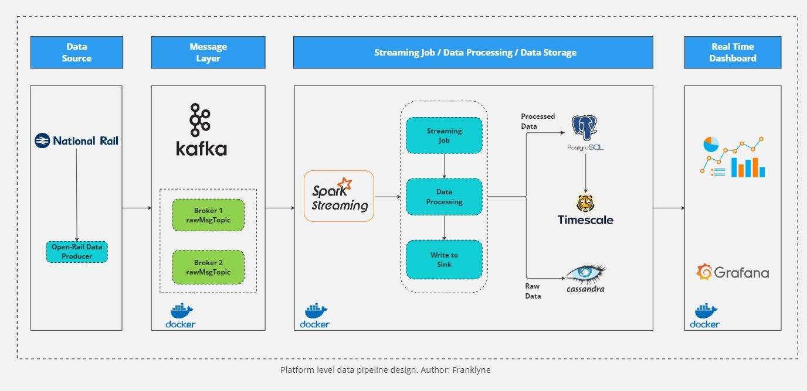
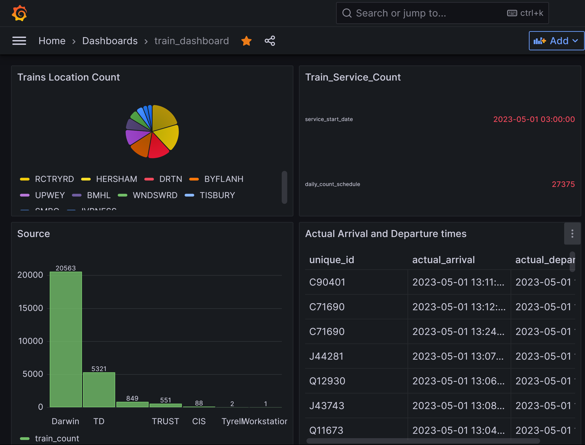

# open-rail-realtime-processing

Real Time Data-Processing of National Rail Data.

## Architecture



## Project Description

This project is a real-time data processing pipeline for the Open Rail data set. The pipeline is built using Kafka, Spark Streaming, and Grafana and runs inside Docker containers. The pipeline ingests real-time data from Open Rail and processes it using Spark Streaming. The processed data is stored in PostgreSQL and TimescaleDB for time-series data. The raw data is stored in Cassandra.

The pipeline has been designed to handle large volumes of data and can easily scale horizontally.

## Technologies used

- Kafka
- Spark Streaming
- Grafana
- PostgreSQL
- TimescaleDB
- Cassandra
- Docker

## Features

- Real-time data processing
- Horizontal scaling
- Data visualization with Grafana
- Containerized using Docker

This project is ideal for anyone interested in real-time data processing, stream processing, time-series data management, containerization, and data visualization. Feel free to fork the project, contribute, or use it as a starting point for your own real-time data processing projects.

## Running the Project

Instructions to Run the Project

1) cd to [src](./src/requirements.txt) and install the requirements.

    ```python
    # Install requirements
    pip install -r requirements.txt
    ```

2) Build Required Images for running Spark.
    cd to [src](./src/docker/spark/build.sh) and run the following command

    ```shell
    # Build Spark Images
    ./build.sh 
    ```

3) Create Docker Network & Volume.

    ``` shell
    # Create Network
    docker network  create kafka-spark-network

    # Create Volume
    docker volume create --name=hadoop-distributed-file-system
    ```

4) Run Services on Docker.

    ```shell
    # Start Docker-Compose (within docker folder)
    docker compose up -d
    ```

5) Build Images for Grafana Dashboard.

    cd to [grafana](./grafana/docker-compose.yaml)

    ```shell
    # Start Docker-Compose
    docker compose up -d
    ```

6) Create Tables for Our Databases.

    ```sql
    -- Postgres Database (execute query in postgres.sql in database folder after connecing to the database)
    pgcli -h {your_container_id} -p {port} -u {user} -d {train_service}
    ```

    ```sql
    -- Cassandra Database (execute query in create_keyspace.sql in database folder)
    docker exec -it cassandra cqlsh
    ```

7) Visit [open-data](https://opendata.nationalrail.co.uk/) to get API key to Access data and subscribe to Darwin Topic Information.

8) Installing spark application dependencies.
    - create a folder in your home directory
    - download [postgres-connector](https://jdbc.postgresql.org/download/postgresql-42.6.0.jar) jar into the folder
    - copy and replace the path to the line below in [spark-submit](./src/streaming/spark-submit.sh)

    ```shell
    --jars path_to_your_jar_folder/postgresql-42.6.0.jar
    ```

9) cd to [streaming](./src/streaming/) to run the data pipeline.

    ```python
    # start the producer.py
    python producer.py
    ```

    ```shell
    # start the spark application
    ./spark-submit streaming.py
    ```

10) Here is simple grafana dashboard
    